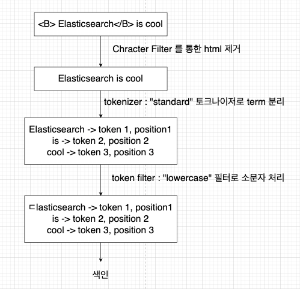

# 1장

## 검색 시스템의 이해

### 검색 시스템이란?

사용자가 원하는 검색어에 대한 결과를 제공하는 하는서비스를 **검색 서비스** 라고 한다.

검색 서비스를 부르는 용어가 다양하고 검색엔진, 검색 시스템, 검색 서비스 등의 용어가 대표적이다.

검색엔진

- 웹에서 정보를 수집해 검색 결과를 제공하는 프로그램
- Elasticsearch

검색시스템

- 검색 엔진을 기반으로 신뢰성 있는 검색결과를 제공하기 위해 구축된 시스템
- 관련도 높은 문서를 검색 결과 상위에 배치하거나 특정 필드나 문서에 가중치를 둬서 검색 정확도 높일수있음

검색 서비스

- 검색엔진을 기반으로 구축한 검색 시스템을 활용해서 검색 결과를 제공하는 서비스

검색 서비스 > 검색 시스템 > 검색엔진(Elasticsearch)

### 검색 시스템의 구성 요소

- 수집기
    - 필요한 정보를 수집하는 프로그램
    - 수집대상이 되는 정보(ex: 파일의 경우 파일명, 파일내용 등) 를 수집하고 저장
    - Logstash 가 그 역할을 한다고 볼 수 있음(로그나 검색 데이터 등을 수집)
    - 29CM 검색시스템에서는 search-indexer 라고 볼 수 있음
- Elasticsearch
    - 색인기
        - 수집한 데이터를 검색에서 활용하려면 검색 가능한 구조로 가공 및 저장이 필요. 색인기가 그 역할 수행
        - 다양한 형태소 분석기를 조합해 정보에서 의미가 있는 용어 추출하고 역색인 구조로 데이터 저장
    - 스토리지
        - 데이터를 저장하는 물리적인 저장소. 색인한 데이터를 스토리지에 저장
    - 검색기
        - 사용자 질의를 입력받아 색인기에서 저장한 역색인 구조에서 일치하는 문서를 찾아 결과로 반환
        - 유사도 기반의 검색 순위 알고리즘으로 판단
        - 형태소 분석기를 이용해 사용자 질의에서 유의미한 용어를 추출하여 검색
        - 형태소 분석기에 따라 검색 품질이 달라짐

검색 프로세스(High Level)

### 관계형 데이터베이스와의 차이점

- 텍스트 매칭을 통한 단순 검색만 가능 VS 텍스트를 여러단어로 변형하여 동의어, 유의어를 활용한 검색
- 정형화된 데이터 저장 VS 비정형 데이터 색인 및 역색인 구조로 빠른 검색 속도 보장

## 검색 시스템과 엘라스틱 서치

요즘엔 대량의 데이터를 빠르게 검색하기 위해 NoSQL 을 사용하는데 엘라스틱서치도 NoSQL 의 일종이다.

분산처리를 통해 실시간에 준하는 빠른 검색이 가능하다.

### 엘라스틱서치가 강력한 이유

오픈소스 검색엔진

- 루씬을 기반으로한 오픈소스 검색엔진
- 전세계 수많은 사람들이 사용하고 있으며 버그가 발생하더라도 빠르게 해결된다.(사용자가많은만큼 버그픽스도 빠르게 대응한다는 뜻으로 이해)

전문검색

- 내용 전체를 색인해서 특정 단어가 포함된 문서를 검색하는 전문검색이 가능하다.

통계 분석

- 비정형 로그 데이터를 수집하여 분석 가능
- 키바나와 연결하여 실시간 로그를 시각화 및 분석도 가능

스키마리스

Restful API

- HTTP 기반 Restful API 를 지원하기때문에 JSON 형식의 요청,응답 가능

멀티테넌시

- Elasticsearch 데이터는 인덱스개념으로 서로 다른 저장소에 분산되어 저장됨
- 관계형 데이터베이스는 서로 다른 저장소에 데이터에 접근하려면 커넥션을 맺어야 하지만 ES 는 별도의 커넥션없이 하나의 질의(쿼리)로 검색하여 검색결과를 하나의 출력으로 묶을수 있음

Document-Oriented (문서 지향)

- 데이터를 document 형태로 저장하고 관리
- Json 처럼 계층을 이룰수 있음(key-value). 그렇기때문에 스키마가 필요없음(schemaless)
- 데이터를 document 에 자유럽게 넣을 수 있음(높은 유연성을 가짐)
- document 마다 존재하는 필드와 그렇지 않은 필드가 있기때문에 쓰지작업을 수행할 때 매우 유용

출처 : 엘라스틱 실무 가이드 (http://www.yes24.com/Product/Goods/71893929)
