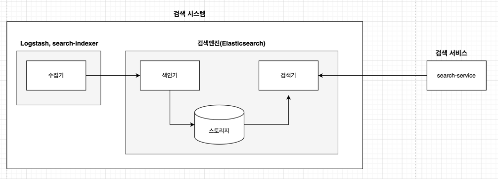

## 매핑 API 이해하기
### 매핑인덱스 만들기
- 매핑은 색인시 데이터가 어디에 어떻게 저장될지를 결정하는 설정. 인덱스에 추가되는 각 데이터 타입을 구체적으로 정의하는 일
- 엘라스틱서치는 기본적으로 스키마리스이기 때문에 매핑 설정없이 색인하면 원하지이않는 타입이 설정될수있음. 실수로 잘못된 타입이 지정될 경우 수정할 방법이 없다.
- 분석가능한 타입은 text, 해당 정보를 그대로 보여주기만 할 필드는 특성에따라 keyword, integer 타입 설정
- 필드는 계층구조를 가질수 있음
```
"mapping": {
    "_doc": {
        "directors": {
            "properties": {
                "peopleNm": {
                    "type": "keyword"
                }
            }
        }
    }
}
```
### 매핑 확인
- ES에서 제공하는 mapping API 로 생성한 매핑정보를 확인가능
```
GET movie_search/_mapping
```
### 매핑 파라미터
- 매핑 파라미터는 색인할 필드의 데이터를 어떻게 저장할지에 대한 다양한 옵션 제공
- analyzer, normalizer, boost, properties...  등등

### 메타 필드
- 메타 필드는 ES 에서 생성한 문서에서 제공하는 특별한 필드
- _index : 해당 문서(document)가 속한 인덱스의 이름을 담고있음
- _type, _uid, _all
- _id : 문서를 식별하는 유일한 키값
- _source : 문서의 원본 데이터를 제공. _reindex API 를 이용해 다른 인덱스에 재색인 가능
- _routing : 특정 문서를 특정 샤드에 저장하기 위해 사용자가 지정하는 메타 필드. 별도설정없이 색인시 문서는 수식에 따라 샤드에 골고루 분산 저장
```
Hash (document_id % num_of_shards)
```
특정 문서를 하나의 샤드에 저장하고 싶을때 _routing 메타 필드 사용. _routing 메타 필드 사용하면 색인시 해당 문서들을 동일한 라우팅 ID로 지정
```
// 색인
PUT test_index/_doc/1?routing=ko
{
    "name": "oktop"
}

// 조회
GET test_index/_search
{
  "query": {
    "terms": {
      "_routing": ["ko"] // 여러개 routing 값 조회 가ㅇ 
    }
  }
}
```

## 엘라스틱서치 분석기
### 텍스트 분석 개요
- ES 는 루씬 기반으로 구축된 텍스트 기반 검색 엔진
- ES 는 문서를 색인하기 전에 해당 문서의 필드 타입이 무엇인지 확인하고 텍스트타입이면 분석기를 이용해 분석

### 역색인 구조
- 모든 문서가 가지는 단어의 고유 단어 목록
- 해당 단어가 어떤 문서에 속해 있는지에 대한 정보
- 전체 문서에 각 단어가 몇 개 들어있는지에 대한 정보
- 하나의 문서에 단어가 몇 번씩 출현했는지에 대한 빈도
- 색인 한다는것은 역색인 파일을 만든다는것. 색인할 때 특정한 규칙과 흐름에 의해 텍스트를 변경하는 과정을 분석(analyze)라고 함

### 분석기의 구조
- 분석기는 다음과 같은 프로세스로 동작
1. 문장을 특정한 규칙에 의해 수정
2. 수정한 문장을 개별 토큰으로 분리
3. 개별 토큰을 특정한 규칙에 의해 변경

- Character Filter
  - 문장을 분석하기전 입력 텍스트에 의해 특정단어를 변경하거나 HTML 과 같은 태그를 제거하는 역할을 하는 필터
- Tokenizer Filter
  - 텍스트를 어떻게 나눌지 정의. 상황에 맞는 적절한 토크나이저 사용가능
- Token Filter
  - 토큰화된 단어를 필터링하여 원하는 토큰으로 변환. 예를들어 불필요한 단어를 제거하거나 동의어사전, lowercase 등 작업 수행가능함

1. 문장이 Character Filter 를 통해 가공
2. 가공된 문장이 Tokenizer Filter 를 통해 텀으로 분리됨
3. 분리된 토큰들이 Token Filter 를 통해 사용자가 원하는 형태로 변환됨
4. 색인
```
PUT /movie_index
{
    "settings": {
        "index": {
            "number_of_shards": 5,
            "number_of_replicas": 1
        }
    },
    "analysis": {
        "analyzer": {
            "custom_movie_analyzer": {
                "type: "custom",
                "char_filter": [
                    "html_strip"
                ],
                "tokenizer": "standard",
                "filter": [
                    "lowercase"
                ]
            }
        }
    }
}
```


### 분석기 사용법
- 분석기를 이용한 분석
  - ES 에서 형태소가 어떻게 분석되는지는 _analyze API 를 통해 확인 가능
```
GET my_index/_analyze
{
  "analyzer": "custom_movie_analyzer",
  "text" : "캐리비안의 해적"
}
```
- 필드를 이용한 분석
  - 인덱스 설정시 필드에 분석기를 직접 설정가능
- 색인과 검색시 분석기를 각각 설정 가능
```
...
"mapping":{
  ...
  "properties":{
    "title":{
      "type":"text",
      "analyzer":"movie_stop_test_analyzer",
      "search_analyer":"movie_lower_test_analyzer"
    }
  }
}
```
- 색인시는 `movie_stop_test_analyzer` 분석기가 동작하게하고 검색시는 `movie_lower_test_analyzer` 사용
- 분석기 매핑시 기본적으로 `analyzer` 항목으로 설정하면 색인,검색 시점에 동일한 분석기를 사용한다는 의미, 각 시점에 다른 분석기를 사용하려면 `search_analyzer` 항목을 이용해 분석기 재정의 필요
```
// 색인
PUT my_index/_doc/1
{
  "title": "Harry Potter and the Chamber of Secrets"
}
```

### 대표적인 분석기(Analyzer)
- Standard
- Whitespace
- Keyword

### 전처리 필터
### 토크나이저 필터
### 토큰 필터
### 동의어 사전

## 참고
http://www.yes24.com/Product/Goods/71893929